# Local Image Forge

A command-line text-to-image generator that runs [Qwen Image 2.1](https://github.com/QwenLM/Qwen-Image-2.1) entirely on a consumer GPU. Describe a subject, pick one of 14 style presets, and get a PNG with no cloud API and no per-image cost.

<p align="center">
  
  
  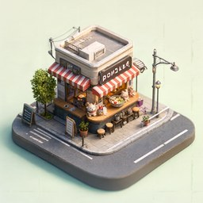
  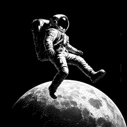
</p>

## Highlights

- **Runs a 33 GB model on a 16 GB GPU.** BF16 weights and block-level CPU offloading with Diffusers let the model run on an RTX 5070 Ti.
- **14 style presets**, from photorealism and anime to ukiyo-e, papercraft and low-poly 3D, each tuned with its own prompt and default aspect ratio.
- **Real pixel art and dithering.** Image models only imitate these styles, so a Pillow post-processing pass snaps output to a true 8 × 8 pixel grid with a 32-color palette, or converts it to 1-bit Floyd–Steinberg dithering.
- **Built-in benchmarking.** Every run reports model load, time to first denoising step, per-step speed, VAE decode, and peak VRAM and RAM, and can export them as JSON.
- **Reproducible.** Seeded generation, a locked `uv` environment, and a script that regenerates every example image and benchmark in this README.

## Gallery

Each image was generated locally, and its exact settings and stats are in `docs/examples/<preset>.json`. Click a thumbnail for the full-resolution PNG.

| Example | Preset | Style and prompt | Size |
| --- | --- | --- | --- |
| <a href="docs/examples/photorealistic.png">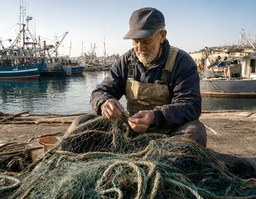</a> | `photorealistic` | Natural-looking photograph<br>*an elderly fisherman mending nets on a harbor pier at dawn* | 1152 × 896 |
| <a href="docs/examples/anime.png">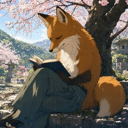</a> | `anime` | Polished anime illustration<br>*a fox reading under a cherry tree* | 1024 × 1024 |
| <a href="docs/examples/cartoon.png"></a> | `cartoon` | Bold, playful cartoon<br>*a grumpy cat chef flipping pancakes in a tiny kitchen* | 1024 × 1024 |
| <a href="docs/examples/ascii.png">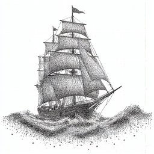</a> | `ascii` | Image styled as ASCII art<br>*a sailing ship on stormy waves* | 1024 × 1024 |
| <a href="docs/examples/dither.png"></a> | `dither` | 1-bit Floyd–Steinberg dithering<br>*an astronaut floating above the moon* | 1024 × 1024 |
| <a href="docs/examples/pixel-art.png"></a> | `pixel-art` | 16-bit pixel art on a true pixel grid<br>*a cozy village tavern on a snowy night* | 1024 × 1024 |
| <a href="docs/examples/watercolor.png"></a> | `watercolor` | Loose watercolor painting<br>*a Venice canal with gondolas in the morning* | 1152 × 896 |
| <a href="docs/examples/oil-painting.png">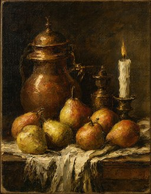</a> | `oil-painting` | Classical oil painting on canvas<br>*a still life of pears, a copper jug, and a candle* | 896 × 1152 |
| <a href="docs/examples/pencil-sketch.png">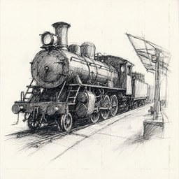</a> | `pencil-sketch` | Graphite pencil sketch<br>*an old steam locomotive waiting at a station* | 1024 × 1024 |
| <a href="docs/examples/ukiyo-e.png">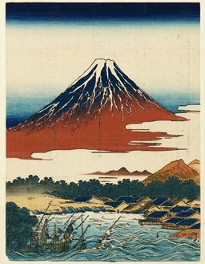</a> | `ukiyo-e` | Japanese woodblock print<br>*Mount Fuji behind a fishing village in autumn* | 896 × 1152 |
| <a href="docs/examples/comic.png">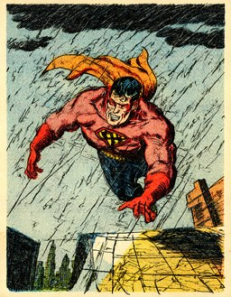</a> | `comic` | Pop-art comic panel with halftone dots<br>*a superhero landing on a rooftop in the rain* | 896 × 1152 |
| <a href="docs/examples/isometric.png"></a> | `isometric` | Tiny isometric 3D diorama<br>*a tiny ramen shop on a street corner* | 1024 × 1024 |
| <a href="docs/examples/papercraft.png">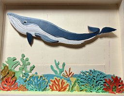</a> | `papercraft` | Layered cut-paper craft<br>*a whale swimming above a coral reef* | 1152 × 896 |
| <a href="docs/examples/low-poly.png">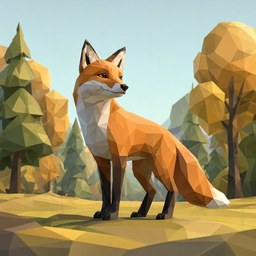</a> | `low-poly` | Faceted low-poly 3D render<br>*a fox in an autumn forest* | 1024 × 1024 |

## Getting started

### Requirements

- Windows with an NVIDIA GPU with 16 GB VRAM and BF16 support (tested on an RTX 5070 Ti) and a recent driver
- 64 GB of system RAM, because the offloaded weights live in RAM
- About 35 GB of free disk space for the model weights
- [uv](https://docs.astral.sh/uv/getting-started/installation/) and Git

### Installation

```powershell
git clone https://github.com/PascaII/local-image-forge.git
cd local-image-forge
uv sync --locked
```

uv installs Python 3.12 and the CUDA 12.8 builds of PyTorch and torchvision. Check that the GPU is visible:

```powershell
uv run python -c "import torch; print(torch.cuda.get_device_name(0))"
```

The first generation downloads the model weights (~33 GB) from Hugging Face into your local cache.

### Usage

```powershell
uv run local-image --preset watercolor --prompt "a lighthouse on a cliff at sunset"
```

The image is saved to `outputs/` and a timing summary is printed:

```text
Saved outputs\watercolor-20260921-172015-492118-2718281.png
Model load            9.5 s
Text encoding         4.7 s
First step ready     16.0 s after start of generation
Denoising           127.7 s (2.98 s/step, 0.34 steps/s)
VAE decode            3.6 s
Time to image       136.1 s (131.8 s/MP)
Total               148.9 s (includes imports and model load)
Peak VRAM            16.6 GiB reserved, 16.4 GiB allocated
Peak RAM             43.6 GiB
```

| Option | Description |
| --- | --- |
| `--prompt` | Subject or scene to generate (required) |
| `--preset` | One of the 14 presets above (default `photorealistic`) |
| `--seed` | Seed for reproducible output (random if omitted) |
| `--output` | PNG path (default `outputs/<preset>-<timestamp>-<seed>.png`) |
| `--width`, `--height` | Override the preset size; multiples of 16 from 256 to 2048 |
| `--steps` | Denoising steps (default 40) |
| `--offload` | `group` (default, faster) or `sequential` (less VRAM, slower) |
| `--no-postprocess` | Keep the raw model output for `dither` and `pixel-art` |
| `--stats-json` | Also write settings and benchmark stats to a JSON file |
| `--dry-run` | Print the final prompt and settings without loading the model |

If you run out of GPU memory, close other GPU applications, try `--offload sequential`, or use a smaller size such as `--width 768 --height 768`.

## Performance

Measured while generating the 14 gallery images, one fresh process each, with the weights already in the OS file cache. The test machine was an RTX 5070 Ti (16 GB), a Ryzen 9 9900X, 64 GB RAM, Windows 11, PyTorch 2.11 with CUDA 12.8, and BF16 with group offloading. Values are medians, with the range in parentheses.

| Metric | Result |
| --- | --- |
| End-to-end per image, including model load | **151 s** (147–164 s) |
| Model load | 9.5 s |
| Prompt encoding | 4.8 s |
| Time to first denoising step | **16.2 s** (15.8–17.5 s) |
| Denoising speed | **2.94 s/step** (0.34 steps/s) |
| 40 denoising steps | 126 s (121–136 s) |
| VAE decode | 4.4 s |
| Time to image | **135 s** (131–148 s) |
| Peak VRAM / process RAM | 16.6 GiB / 43.7 GiB |
| GPU utilization, average power | 60 %, 103 W |

**Takeaways**

- **Diffusion has no "time to first token."** The whole image is refined at once over 40 steps. The closest latency measure is the time until the first denoising step starts, about 16 s.
- **Memory bandwidth limits speed, not compute.** The weights don't fit in VRAM, so every step streams transformer blocks from system RAM over PCIe. The GPU averages only 60 % utilization at about a third of its power budget. A 512 × 512 image takes nearly the same time per step as a 1024 × 1024 one, so larger images cost almost nothing extra per step.
- **Peak VRAM slightly exceeds the physical 15.9 GiB.** The Windows driver spills the overflow into shared system memory instead of failing with an out-of-memory error.

To reproduce the gallery and these numbers, run the following. It writes images, thumbnails and `benchmarks.json` to `docs/examples/`, and skips presets that already have results.

```powershell
uv run python scripts/build_examples.py
```

## How it works

```text
local_image_generator/
├── cli.py          # argument parsing, validation, dry runs, stats output
├── presets.py      # style presets: prompt template, default size, optional post-processing
├── runtime.py      # model loading, CPU offloading, generation and timing instrumentation
└── postprocess.py  # Pillow passes: 1-bit dithering and pixel-grid snapping
scripts/
└── build_examples.py  # generates and benchmarks the gallery
```

- **Presets** wrap the subject in a style-specific prompt, so `--prompt` only needs to describe *what* to draw.
- **Offloading** keeps the model in system RAM and moves one transformer block at a time onto the GPU (`enable_group_offload`). This trades speed for fitting a 33 GB model on a 16 GB card.
- **Timing** uses the pipeline's per-step callback and a wrapper around prompt encoding, with CUDA synchronization at each phase boundary, so no changes to Diffusers are needed.
- **Heavy imports are deferred.** `--help`, `--dry-run` and the tests never import PyTorch, so they run instantly.

Run the tests with:

```powershell
uv run python -m unittest discover -s tests
```

## License

The code in this repository is [MIT licensed](LICENSE). **The Qwen Image 2.1 model weights are not included and have their own [Qwen Research License](https://huggingface.co/Qwen/Qwen-Image-2.1/blob/main/LICENSE)**, which allows noncommercial research and evaluation. Commercial use requires a separate license from Qwen.

Built with [Diffusers](https://github.com/huggingface/diffusers), following [Qwen's quick start](https://github.com/QwenLM/Qwen-Image-2.1) and the [Diffusers memory optimization guide](https://huggingface.co/docs/diffusers/optimization/memory).
